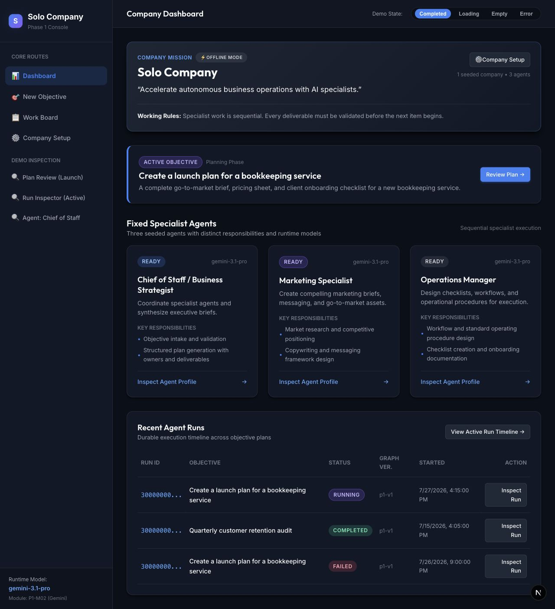
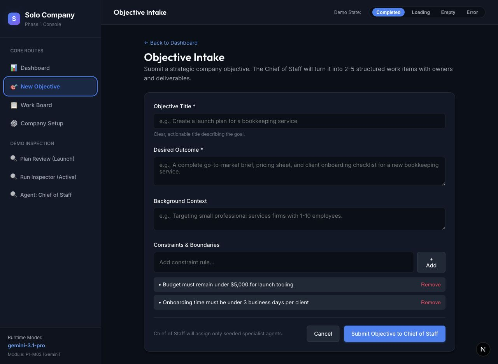
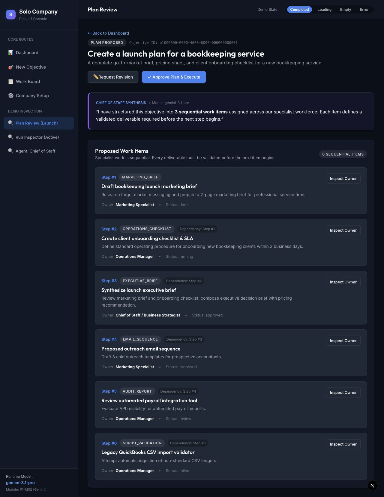
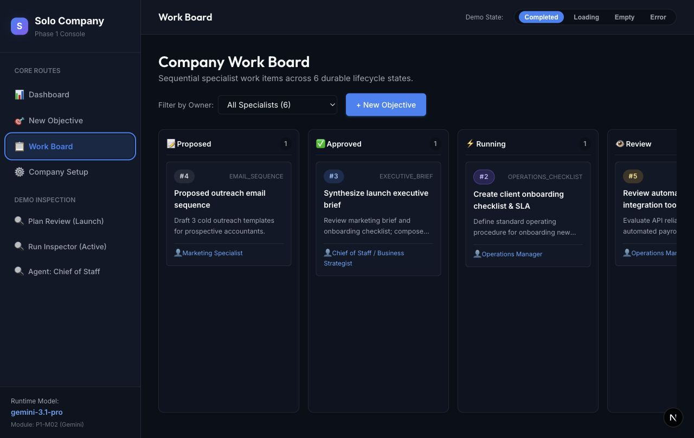
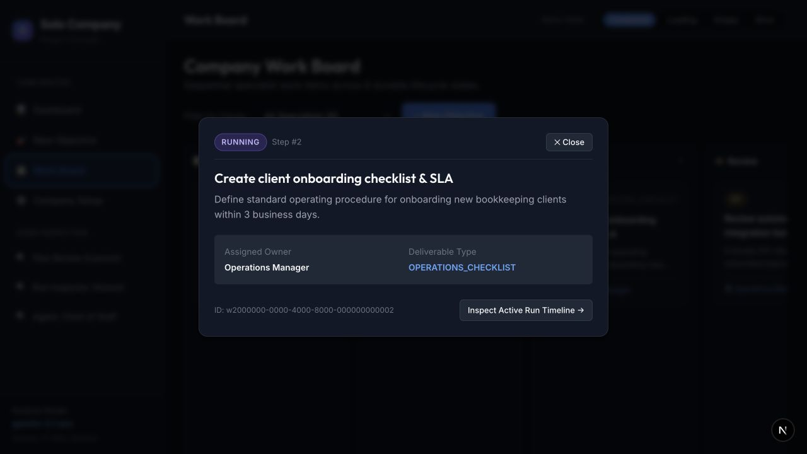
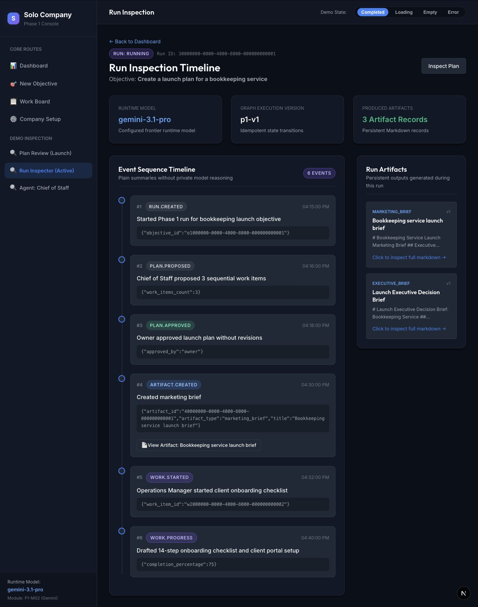
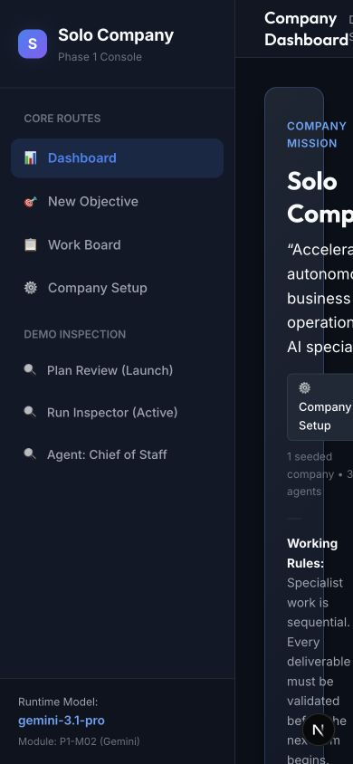

# Solo Company Product Design Audit

Date: 2026-07-29

## Audit scope

Combined UX, visual-design, and accessibility review of the main owner journey:

1. Understand the dashboard
2. Create an objective
3. Review a proposed plan
4. Monitor work
5. Inspect a work item
6. Inspect execution and deliverables
7. Check the dashboard at a mobile viewport

The review used the running local product and its seeded demo data. It did not submit a new objective, approve a plan, or otherwise change product data.

## Overall verdict

The application has a coherent workflow and a consistent dark visual system, but it reads like an engineering console rather than an owner workspace. The main problem is not simply the amount of text. Product decisions, explanatory copy, implementation metadata, demo controls, IDs, raw event data, and secondary inspection links are presented with similar visual weight. This makes users learn the system before they can see what needs attention.

The highest-value redesign is to separate the experience into two layers:

- **Owner layer:** decisions, progress, blockers, deliverables, and next actions.
- **Technical details:** agents, models, run IDs, graph versions, event payloads, and demo tools, hidden behind an optional disclosure.

## Flow review

### 1. Dashboard — needs restructuring

**What works**

- The active objective and its primary action are easy to spot.
- Status colors are used consistently.
- The layout uses repeatable cards and predictable spacing.

**What gets in the way**

- Mission, working rules, agents, runtime models, run history, demo controls, and the active objective all compete for attention.
- “Fixed Specialist Agents” occupies the most valuable dashboard space even though it is setup/reference information rather than daily owner work.
- “Phase 1 Console,” “seeded company,” “runtime models,” and “sequential specialist execution” sound like implementation documentation.
- The same destination appears in several places, increasing choice without adding clarity.

**Recommendation**

Make the dashboard a “Today” view with three sections: **Needs your decision**, **In progress**, and **Recent deliverables**. Keep one prominent **New objective** action. Move mission, working rules, agent profiles, runtime details, and demo routes out of the primary dashboard.

### 2. Objective creation — generally healthy, but too formal

**What works**

- Fields have clear labels, required indicators, and examples.
- The form is short enough to complete in one sitting.
- Constraints are represented as editable rules rather than a large free-text field.

**What gets in the way**

- “Objective Intake” sounds procedural and is repeated in the top bar and page heading.
- The introductory sentence explains the internal agent workflow before helping the user express the goal.
- Optional context and constraints look just as important as the two required fields.
- The screen promises 2–5 work items, but the reviewed plan contains 6.

**Recommendation**

Rename this screen to **Create an objective**. Lead with “What do you want the company to achieve?” Use a lightweight three-part stepper—Goal, Context, Guardrails—or keep optional fields collapsed under **Add context and constraints**. Replace the model/agent explanation with a short outcome preview.

### 3. Plan review — high-risk decision screen

**What works**

- Revision and approval are presented as distinct actions.
- Ownership and dependencies are visible for every step.
- The sequential plan is understandable once the user reads through it.

**What gets in the way**

- The Chief of Staff summary says there are 3 work items while the list and badge show 6. The creation screen promised at most 5. This directly damages trust at the moment of approval.
- Six large cards create a long review without an executive summary of duration, risks, outputs, or what changed.
- Technical IDs, snake_case deliverable types, model names, and status metadata distract from the business decision.
- Approval controls are only at the top, so they disappear while the user reviews the bottom of the plan.

**Recommendation**

Add a compact decision summary first: expected result, estimated duration, deliverables, key assumptions, risks, and number of steps. Show steps as a compact vertical timeline with expandable detail. Use human labels such as “Marketing brief,” not `MARKETING_BRIEF`. Add a sticky review bar with **Request changes** and **Approve and start**. Block approval when counts or data are inconsistent.

### 4. Work board — structurally overloaded

**What works**

- The lifecycle states and work owners are visible.
- The owner filter is easy to find.
- Each work item has a concise title and short description.

**What gets in the way**

- Six columns do not fit the default viewport; the Review column is clipped and Done/Failed are off-screen.
- Horizontal position is doing too much work. Users cannot see the whole workflow and compare states at once.
- Cards do not visibly announce that they are clickable.
- Emoji icons and small uppercase metadata make the interface feel like a prototype rather than a finished product.

**Recommendation**

Default to a priority-oriented list with tabs: **Needs attention**, **In progress**, **Upcoming**, and **Done**. Keep the six-column board as an optional desktop view. If the board remains primary, reduce it to four owner-friendly states and add a clear horizontal-scroll affordance. Use a consistent icon library rather than emoji.

### 5. Work-item detail — healthy shell, thin content

**What works**

- The modal is visually focused and easy to scan.
- Status, owner, and next navigation are grouped clearly.

**What gets in the way**

- It shows identifiers and deliverable type but not the information an owner most needs: current progress, blocker, expected completion, latest update, or deliverable preview.
- The underlying work cards and modal appear as generic elements in the captured accessibility tree, which creates a likely keyboard and screen-reader risk.
- The close control is clear visually, but dialog semantics, focus trapping, and focus restoration need verification.

**Recommendation**

Make this a decision-ready detail panel with **Progress**, **Latest update**, **Blockers**, **Expected output**, and **View deliverable**. Move the raw ID into a collapsed **Technical details** area. Implement cards as semantic buttons/links and the overlay as an accessible dialog.

### 6. Run inspection — too technical for the default owner view

**What works**

- The chronological timeline communicates that work is durable and traceable.
- Human-readable event summaries are shown alongside technical data.
- Deliverables are available from the same screen.

**What gets in the way**

- Runtime model, graph version, event types, JSON payloads, IDs, and Markdown previews dominate the screen.
- The current task, overall progress, blocker, and expected next step are not summarized.
- The page reports 3 artifact records while only 2 artifact cards are visible.
- “Run inspection,” “persistent Markdown records,” and “idempotent state transitions” are developer language.

**Recommendation**

Rename the owner-facing view to **Activity**. Lead with a progress summary: current step, percent complete, latest update, next expected action, and any blocker. Show deliverables as polished documents with clear titles and actions. Put the full event stream, JSON, model, graph version, and IDs inside **Technical details**.

### 7. Mobile dashboard — broken

**What works**

- Navigation labels remain readable.

**What gets in the way**

- The fixed 260px sidebar consumes most of a 390px viewport.
- The main content is reduced to a narrow strip, causing severe wrapping and clipping.
- There is no visible mobile navigation pattern or responsive content reflow.

**Recommendation**

At tablet/mobile breakpoints, replace the sidebar with a top bar and menu drawer or a compact bottom navigation. Stack dashboard sections, turn tables into cards, and use the priority list rather than the six-column board.

## Highest-impact redesign priorities

### P0 — Fix trust and basic usability

1. Resolve the 2–5 / 3 / 6 work-item count inconsistencies.
2. Resolve the 3-artifact / 2-visible-artifact inconsistency.
3. Add responsive navigation and mobile layouts.
4. Make clickable work cards and the detail modal keyboard- and screen-reader-friendly.

### P1 — Make the product owner-first

1. Replace the dashboard with a decision-and-progress home.
2. Hide technical and demo metadata by default.
3. Turn plan review into a concise decision summary with expandable detail.
4. Replace the six-column default board with a priority list or four owner-friendly states.
5. Redesign run inspection around progress, blockers, next action, and deliverables.

### P2 — Improve beauty and polish

1. Reduce the number of bordered cards and use whitespace to group related content.
2. Increase contrast for small secondary text and avoid very dim metadata.
3. Use one icon family instead of emoji.
4. Use sentence case for human labels and reserve uppercase for short status chips.
5. Keep a single primary accent color; use semantic colors only for status and attention.
6. Add subtle progress visuals and deliverable thumbnails instead of more text.

## Suggested information architecture

- **Home** — decisions, active objectives, blockers, recent deliverables
- **Objectives** — create, draft, proposed, active, completed
- **Work** — needs attention, in progress, upcoming, done
- **Deliverables** — briefs, checklists, reports, versions
- **Settings** — company, working rules, specialists, model/runtime details

Use **New objective** as the persistent primary action rather than a peer navigation destination.

## Copy changes

| Current | Suggested |
|---|---|
| Phase 1 Console | Owner workspace |
| Objective Intake | Create an objective |
| Fixed Specialist Agents | Your team |
| Run Inspection Timeline | Activity |
| Produced Artifact Records | Deliverables |
| Inspect Active Run Timeline | View activity |
| Request Revision | Request changes |
| Approve Plan & Execute | Approve and start |
| Sequential specialist execution | Work runs one step at a time |

## Accessibility risks and limits

- Small tertiary text and metadata appear low-contrast against dark surfaces; contrast should be measured in the final design.
- Work cards do not appear as interactive controls in the captured accessibility tree.
- The detail overlay does not appear as a dialog in the captured accessibility tree.
- Keyboard order, visible focus across all controls, focus trapping/restoration, screen-reader announcements, form error recovery, and reduced-motion behavior were not fully tested.
- The mobile screenshot confirms failed reflow at 390×844, but additional tablet, zoom, and landscape checks are still needed.
- This audit does not claim WCAG compliance.

## Recommended visual direction

Keep dark mode, but shift from “technical control panel” to a calm command center:

- fewer, larger information groups;
- stronger hierarchy between decisions, progress, and metadata;
- a single blue primary action;
- warm amber only for attention;
- green only for completed outcomes;
- brighter body text and less ultra-small gray copy;
- real icons, progress indicators, and deliverable previews;
- technical details available, but collapsed by default.
