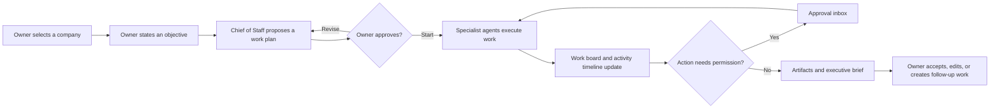
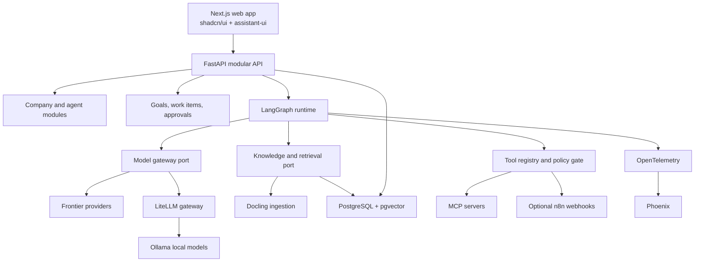

# Solo Company Platform — Master Plan

Status: proposed  
Plan date: 2026-07-27  
Source: [AI Agent Workforce Framework & Job Descriptions](https://docs.google.com/document/d/1vQdag1E26U462IJy5_rgW7xiHLOR6fL1G5E4Vg3hkYg/edit)

## 1. Product decision

Build a **modular monolith for a single owner** before building a platform.

The first useful product is not a marketplace of autonomous employees. It is a clear operating console where the owner can:

1. describe one company and one objective;
2. see a Chief of Staff turn the objective into work;
3. see three agents own and complete that work;
4. inspect status, concise decision summaries, outputs, failures, and costs;
5. approve the plan and keep control.

Only after this loop is useful should the product add knowledge, skills, tools, scheduled autonomy, and multiple companies.

## 2. What the source document contributes

The source defines twelve useful role templates across executive operations, marketing, sales, engineering, support, finance, and legal. It also recommends LangGraph or CrewAI, LiteLLM, Ollama, MCP, n8n, vector storage, and an observability UI.

This plan keeps the strongest parts but reduces the first implementation:

- Keep **LangGraph** for explicit, stateful orchestration and later human-in-the-loop execution.
- Keep **LiteLLM** and **Ollama**, but introduce the user-facing model chooser in Phase 2.
- Keep **MCP** as the tool boundary, but begin with one read-only web-search tool.
- Use **PostgreSQL + pgvector** instead of a separate relational database and Chroma/Qdrant service.
- Use **Docling** for book and document parsing rather than writing PDF ingestion.
- Use the open **Agent Skills `SKILL.md` format** rather than inventing a proprietary skill format.
- Use **Phoenix + OpenTelemetry** for local tracing and evaluation.
- Keep **n8n optional and external**. Its fair-code license permits many internal uses, but embedding or reselling its functionality needs a separate licensing review.
- Build a thin product UI with **Next.js, shadcn/ui, and assistant-ui**. Open WebUI remains useful for model testing, but it is not the core product because the main experience is a company, work board, approval inbox, and agent activity timeline rather than a generic chat screen.

Primary references:

- [LangGraph](https://github.com/langchain-ai/langgraph)
- [LangGraph Agent Chat UI reference](https://github.com/langchain-ai/agent-chat-ui)
- [assistant-ui](https://github.com/assistant-ui/assistant-ui)
- [LiteLLM](https://github.com/BerriAI/litellm)
- [Ollama](https://github.com/ollama/ollama)
- [pgvector](https://github.com/pgvector/pgvector)
- [Docling](https://github.com/docling-project/docling)
- [Agent Skills specification](https://openagentskills.dev/docs/specification)
- [MCP Python SDK](https://github.com/modelcontextprotocol/python-sdk)
- [Phoenix](https://github.com/Arize-ai/phoenix)
- [Tavily MCP server](https://github.com/tavily-ai/tavily-mcp)
- [n8n Sustainable Use License](https://docs.n8n.io/sustainable-use-license/)

## 3. North-star journey



The UI must show observable work, not hidden chain-of-thought. Store and display:

- task state and ownership;
- concise model-generated decision summaries;
- model and prompt version;
- retrieved sources and citations;
- proposed and executed tool calls;
- artifacts, errors, duration, token use, and estimated cost.

Do not request, persist, or present private chain-of-thought.

## 4. Architecture



### Deployable units

Keep one repository and only these deployable units:

- `web`: Next.js application;
- `api`: FastAPI application and synchronous LangGraph entrypoints;
- `worker`: the same Python codebase running durable jobs from Phase 3 onward;
- `postgres`: state, event log, and vectors;
- optional infrastructure: LiteLLM, Ollama, Phoenix, object storage, and n8n.

Do not split business modules into network services. Module boundaries are Python and TypeScript package boundaries until measured load proves otherwise.

### Suggested repository shape

```text
apps/
  web/
  api/
    src/
      company/
      agents/
      work/
      runs/
      model_gateway/
      knowledge/
      skills/
      tools/
      approvals/
      observability/
infra/
  compose.yaml
docs/
  architecture/
  modules/
  roadmap/
```

The API's OpenAPI document is the frontend contract. Generate the TypeScript client; do not maintain duplicate request/response types by hand.

## 5. Stable domain boundaries

These boundaries exist from Phase 1, even when some implementations are simple:

| Boundary | Owns | Must not own |
| --- | --- | --- |
| Company | company profile and settings | agent execution |
| Agents | role definitions and assigned capability IDs | provider secrets |
| Work | objectives, work items, status transitions | model SDK calls |
| Runs | run lifecycle, event stream, artifacts | business role prompts |
| Model gateway | model aliases, provider calls, usage | orchestration decisions |
| Knowledge | documents, chunks, retrieval, citations | tool permissions |
| Skills | `SKILL.md` packages and versions | arbitrary unsandboxed execution |
| Tools | MCP connections, schemas, invocation policy | model selection |
| Approvals | deterministic allow/confirm/block decisions | prompt-based authorization |
| Observability | traces, metrics, evaluations | product source of truth |

All business records include `company_id` from the first migration. Phase 1 has one seeded company, but this avoids a destructive tenancy migration in Phase 4.

## 6. Phase map

| Phase | Outcome | Main gate |
| --- | --- | --- |
| 1. Single-company MVP | One company can turn an objective into visible agent work and artifacts | A complete deterministic demo works with a fake model and one real frontier model |
| 2. Models, knowledge, skills, tools | Agents can select frontier/local models, use books and skills, and call one read-only tool | Answers cite uploaded sources; local and frontier routes both pass capability tests |
| 3. Safe autonomy and quality | Work can run in the background under permissions, approvals, evaluation, and audit | A scheduled run survives restart and every side effect is allowed, confirmed, or blocked deterministically |
| 4. Multi-company portfolio | The owner can create, switch, clone, and operate isolated companies | Automated isolation tests prove no cross-company reads, retrieval, runs, or tool credentials |
| 5. Production readiness | The system is secure, recoverable, observable, deployable, and documented | Security, restore, load, and release-readiness gates pass |

## 7. Coding-model ownership

The coding-model workflow is sequential and module-based. GPT and Gemini must not both implement the same module.

**Ownership is based on complexity, risk, and scope—not alternation.** It is normal for GPT to own several consecutive hard modules or for Gemini to own several consecutive easy modules. Do not switch models merely to create a GPT/Gemini/GPT pattern.

Use this decision rule:

| Question | If yes |
| --- | --- |
| Does the task define architecture, security policy, shared contracts, or irreversible data behavior? | GPT |
| Does it span several modules or require difficult failure/recovery reasoning? | GPT |
| Does it involve agent orchestration, concurrency, isolation, RAG quality, or tool execution? | GPT |
| Is it bounded by an already-approved contract with limited files and predictable behavior? | Gemini |
| Is it primarily UI, CRUD, fixtures, documentation, or presentation polish? | Gemini |

When uncertain, choose GPT for high-consequence uncertainty and Gemini for low-risk, locally testable work.

### Assign GPT when the module involves

- architecture or cross-module contracts;
- novel database schemas, data migrations, and transactional invariants;
- LangGraph orchestration and state recovery;
- model routing, RAG, retrieval evaluation, or MCP execution;
- concurrency, retries, idempotency, isolation, or security;
- integration tests that cross several boundaries;
- production deployment or incident recovery.

### Assign Gemini 3.1 Pro when the module involves

- a bounded screen implemented against an approved API contract;
- forms, tables, filters, empty/error states, and responsive behavior;
- CRUD endpoints and straightforward migrations against an approved schema, with no security-sensitive policy;
- fixtures, Storybook-style states, user documentation, and demo data;
- generated API-client consumption without backend contract changes.

Google currently lists the exact API name as `gemini-3.1-pro-preview`; it is a preview model, so keep the coding-model name in developer tooling rather than product code and re-check the [official model lifecycle](https://ai.google.dev/gemini-api/docs/deprecations) before each implementation phase.

For GPT, use the strongest available GPT coding model appropriate to the module. Do not pin a roadmap document to a model name that will age before the product ships.

### Required module handoff

Before a coding model starts a module, create `docs/modules/<phase>/<module-id>.md` containing:

1. objective and owner;
2. allowed files and explicitly excluded files;
3. approved API/events/database contracts;
4. dependencies and assumptions;
5. acceptance tests and commands;
6. definition of done;
7. decisions that require a new ADR.

At completion, the owning model adds:

- changed files;
- tests executed and results;
- migrations or environment changes;
- known limitations;
- exact next module dependency.

The next model reads the handoff and consumes the contract. It does not silently redesign the previous module.

### Integration rule

Each module lands as one focused branch or commit series. Cross-boundary integration is normally GPT-owned because it requires system-level reasoning. Bounded follow-up fixes, documentation, and visual polish may be Gemini-owned. This is a complexity rule, not a required end-of-phase alternation.

## 8. Definition of done for every module

A module is complete only when:

- its public contract is typed and documented;
- happy path, empty state, error state, and authorization behavior are defined;
- tests use a fake model/tool where possible and do not require paid API calls;
- database changes include forward migration and rollback notes;
- logs contain IDs and summaries, not secrets or hidden reasoning;
- the UI is keyboard-usable and has loading and failure feedback;
- no unrelated module was rewritten;
- the module handoff is updated.

## 9. Key decisions that minimize work

1. **Three agents first, not twelve.** Phase 1 uses Chief of Staff / Business Strategy, Marketing, and Operations. The source document's full role catalog becomes templates later.
2. **One explicit graph first.** Do not build a generic visual workflow builder.
3. **Sequential specialist execution first.** Parallel work arrives only after event ordering and recovery are proven.
4. **One runtime provider first.** Phase 1 uses one configured frontier model behind an interface; Phase 2 adds LiteLLM and Ollama selection.
5. **One database.** PostgreSQL stores operational data, LangGraph checkpoints, and vectors.
6. **One read-only external tool first.** Tavily MCP proves the tool boundary without creating side effects.
7. **Instruction-only skills first.** Scripts from imported skills remain disabled until Phase 3 provides a sandbox.
8. **No generic plugin marketplace.** Curate skills and MCP servers explicitly.
9. **No Kubernetes.** Use Docker Compose for development and a small production topology until measured demand requires an orchestrator.
10. **No collaboration, billing, mobile app, or customer-facing portal in the initial roadmap.**

## 10. Architecture decision records to create during implementation

- ADR-001: modular monolith and repository boundaries;
- ADR-002: event vocabulary and artifact contract;
- ADR-003: LangGraph state and checkpoint policy;
- ADR-004: provider-neutral model aliases;
- ADR-005: skill trust and script-execution policy;
- ADR-006: retrieval scope, chunking, and citation contract;
- ADR-007: MCP permission and approval policy;
- ADR-008: company isolation strategy;
- ADR-009: production identity provider and deployment target.

## 11. Major risks

| Risk | Early mitigation |
| --- | --- |
| Agent output looks busy but is not useful | Define artifact schemas and acceptance criteria per work type |
| Model/provider changes break the app | Use capability-based aliases and contract tests |
| Local models fail complex tasks | Route only tested task classes locally and show fallback reasons |
| RAG answers sound grounded but are wrong | Require citations, retrieval evaluation, and source preview |
| Web or document content injects malicious instructions | Treat retrieved content as untrusted data and gate every tool call |
| Imported skills execute unsafe code | Instruction-only in Phase 2; signed/approved sandbox in Phase 3 |
| Cross-company leakage | Carry `company_id` from day one and add adversarial isolation tests before Phase 4 release |
| Costs grow invisibly | Record tokens/cost per run and add budgets before autonomy |
| n8n licensing constrains a commercial product | Keep it out-of-process and optional; review licensing before customer exposure |
| Two coding models create inconsistent architecture | Contract-first module handoffs and one owner per module |

## 12. Roadmap files

- [Phase 1 — Single-company MVP](./01-phase-1-single-company-mvp.md)
- [Phase 2 — Models, knowledge, skills, and tools](./02-phase-2-models-knowledge-skills-tools.md)
- [Phase 3 — Safe autonomy and quality](./03-phase-3-safe-autonomy-and-quality.md)
- [Phase 4 — Multi-company portfolio](./04-phase-4-multi-company-portfolio.md)
- [Phase 5 — Production readiness](./05-phase-5-production-readiness.md)
