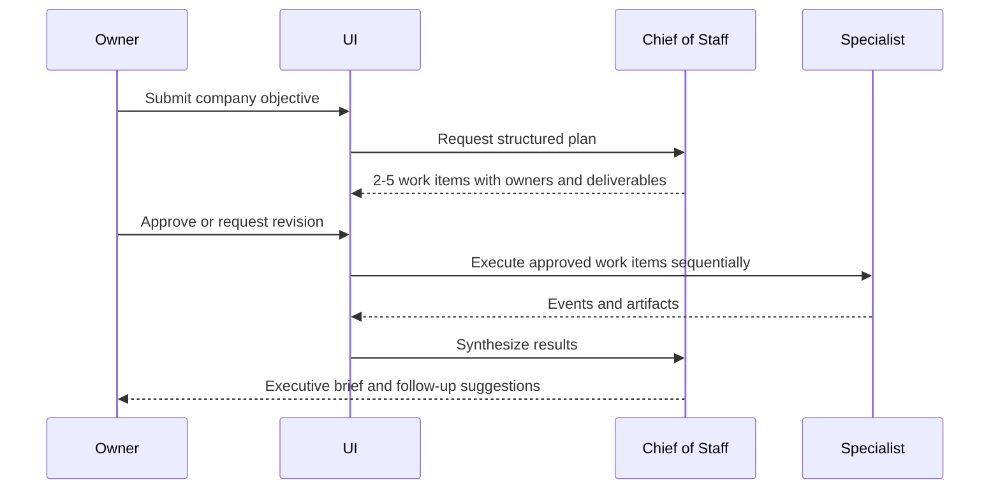

# Phase 1 — Single-Company MVP

## Outcome

The owner can configure one company, submit an objective, approve a proposed plan, watch three agents do visible work, and review the final artifacts and executive brief.

This phase proves the product loop. It does not prove RAG, tools, local models, or autonomous operation.

## Scope

### Included

- one seeded company that the owner can rename and describe;
- three fixed but editable agent profiles:
  - Chief of Staff / Business Strategist;
  - Marketing Specialist;
  - Operations Manager;
- objective intake;
- structured plan generation;
- plan approval or revision;
- sequential specialist execution;
- work board, agent status, run timeline, artifacts, and executive brief;
- one configured frontier runtime model;
- persistent run events and fake-model test mode.

### Explicitly excluded

- RAG, book upload, skills, MCP, web search, and external tools;
- user-facing model chooser and Ollama;
- scheduled or unattended work;
- agent creation/deletion and the full twelve-role catalog;
- multi-company switching;
- user accounts, teams, billing, mobile app, Slack, or email;
- parallel subagents and generic workflow builders.

## Core experience



The Chief of Staff may assign only the seeded specialist agents. It may not invent tools, agents, or completed facts.

## Screens

| Route | Purpose | Minimum content |
| --- | --- | --- |
| `/` | Company dashboard | company mission, three agent cards, active objective, recent runs |
| `/objectives/new` | Objective intake | title, desired outcome, context, constraints, submit |
| `/objectives/[id]/plan` | Plan review | work items, owner, deliverable, dependency, approve, revise |
| `/work` | Work board | proposed, approved, running, review, done, failed |
| `/runs/[id]` | Run inspection | status, event timeline, model alias, errors, artifacts |
| `/agents/[id]` | Agent profile | role, objective, responsibilities, current status, recent work |
| `/settings/company` | Company setup | name, description, mission, working rules |

Use realistic empty, loading, error, and completed states. The activity timeline must use plain summaries such as “Created marketing brief” rather than claiming to reveal private model reasoning.

## Runtime graph

Implement one explicit graph:

```text
intake
  -> validate_objective
  -> create_plan
  -> wait_for_plan_approval
  -> execute_next_work_item
  -> persist_artifact
  -> repeat_until_complete
  -> synthesize_executive_brief
  -> complete
```

Rules:

- structured model outputs use Pydantic schemas;
- graph nodes are idempotent where practical;
- all state transitions append a run event;
- a failed work item stops the phase-1 run and offers retry;
- specialist work is sequential;
- graph tests use a deterministic fake model;
- prompts live in versioned files, not inline in route handlers.

## Initial data model

All tables include timestamps. All business tables include `company_id`, even though only one company exists.

| Table | Minimum fields |
| --- | --- |
| `companies` | `id`, `name`, `description`, `mission`, `working_rules` |
| `agent_definitions` | `id`, `company_id`, `slug`, `name`, `role`, `objective`, `responsibilities`, `runtime_model_alias`, `prompt_version`, `enabled` |
| `objectives` | `id`, `company_id`, `title`, `desired_outcome`, `context`, `constraints`, `status` |
| `work_items` | `id`, `company_id`, `objective_id`, `parent_id`, `assigned_agent_id`, `title`, `instructions`, `deliverable_type`, `status`, `position` |
| `agent_runs` | `id`, `company_id`, `objective_id`, `status`, `graph_version`, `started_at`, `finished_at`, `error_code` |
| `run_events` | `id`, `company_id`, `run_id`, `sequence`, `event_type`, `summary`, `payload_json`, `created_at` |
| `artifacts` | `id`, `company_id`, `run_id`, `work_item_id`, `artifact_type`, `title`, `content_markdown`, `version` |

`payload_json` must be schema-validated and size-bounded. Secrets and hidden reasoning are forbidden.

## Event vocabulary

Begin with a small stable vocabulary:

- `run.created`
- `plan.proposed`
- `plan.revision_requested`
- `plan.approved`
- `work.started`
- `work.progress`
- `artifact.created`
- `work.completed`
- `work.failed`
- `brief.created`
- `run.completed`
- `run.failed`

The frontend consumes persisted events through Server-Sent Events and can reload the complete timeline from the REST API.

## Module order and coding-model ownership

Each module gets its own handoff document before implementation.

The sequence deliberately groups bounded work where practical. Owners are selected by difficulty, not by alternating models.

| Order | Module | Owner | Deliverable | Acceptance |
| --- | --- | --- | --- | --- |
| 1 | P1-M01 Architecture, contracts, and repository bootstrap | GPT | monorepo, ADR-001/002, OpenAPI/event schemas, test harness | web and API boot; fake event fixture validates |
| 2 | P1-M02 Web shell and static product states | Gemini | navigation, dashboard shell, agent cards, work board, run timeline using fixtures | responsive routes render all primary states |
| 3 | P1-M03 Bounded company, agent, and work CRUD | Gemini | straightforward migrations and REST endpoints against P1-M01 contracts | API tests prove validation, transitions, and `company_id` scoping |
| 4 | P1-M04 Company and agent profile UI | Gemini | settings and agent screens consuming generated client | edits persist; validation and failures are visible |
| 5 | P1-M05 Minimal LangGraph runtime | GPT | graph, prompts, fake/real model adapter, checkpoints, event persistence | fake-model run is deterministic; real-model smoke test is optional and isolated |
| 6 | P1-M06 End-to-end integration and reliability | GPT | contract repair, integration tests, SSE/retry behavior, error taxonomy | backend flow passes from a clean database |
| 7 | P1-M07 Objective, plan review, board, and run UI | Gemini | objective form, approval screen, SSE updates, artifacts | owner can complete the full flow without refreshing |
| 8 | P1-M08 UX polish, demo data, and operator guide | Gemini | accessible states, sample company, concise setup and demo docs | demo can be followed without reading source code |

Gemini modules may not change database or event contracts. Contract changes return to a new GPT-owned module.

## Reused building blocks

- [LangGraph](https://github.com/langchain-ai/langgraph) for the explicit state graph;
- [assistant-ui](https://github.com/assistant-ui/assistant-ui) or components adapted from [LangGraph Agent Chat UI](https://github.com/langchain-ai/agent-chat-ui) for streaming conversation primitives;
- FastAPI, Pydantic, SQLAlchemy, and Alembic for API and persistence;
- Next.js, TypeScript, shadcn/ui, Tailwind CSS, and TanStack Query for the web app;
- PostgreSQL for state;
- Docker Compose for local services;
- `uv` for Python and `pnpm` for JavaScript dependencies.

Do not fork an entire agent platform. Reuse libraries and selected UI patterns while retaining the product-specific company and work experience.

## API surface

Minimum endpoints:

```text
GET    /api/company
PATCH  /api/company
GET    /api/agents
GET    /api/agents/{agent_id}
PATCH  /api/agents/{agent_id}
POST   /api/objectives
GET    /api/objectives
GET    /api/objectives/{objective_id}
POST   /api/objectives/{objective_id}/plan
POST   /api/objectives/{objective_id}/plan/revise
POST   /api/objectives/{objective_id}/plan/approve
GET    /api/work-items
GET    /api/runs/{run_id}
GET    /api/runs/{run_id}/events
GET    /api/runs/{run_id}/stream
GET    /api/runs/{run_id}/artifacts
```

Starting execution must use an idempotency key so double-clicking approval does not start duplicate runs.

## Test strategy

### Unit

- objective and plan schema validation;
- allowed work-item state transitions;
- agent assignment constraints;
- graph routing and failure mapping;
- ordered event sequences;
- prompt rendering without missing variables.

### Integration

- migration from empty database;
- company-scoped repositories;
- plan approval starts one run only;
- run and artifact persistence;
- reconnecting SSE resumes after the last sequence number.

### End-to-end

Use a fake model to:

1. edit the sample company;
2. submit “Create a launch plan for a bookkeeping service”;
3. approve a three-item plan;
4. watch three work items complete;
5. open two artifacts and the executive brief;
6. reload the page and see the same state.

## Exit criteria

Phase 1 is complete when:

- the end-to-end demo passes from a clean checkout and database;
- every run is inspectable after page reload;
- failures are visible and retryable;
- no paid API is required for automated tests;
- a real frontier-model smoke test can complete the same flow;
- no Phase 2 capability has leaked into the UI;
- the owner can judge what each agent did and what artifact it produced.

Do not begin Phase 2 merely because the chat response works. The full objective-to-artifact loop must be reliable first.
