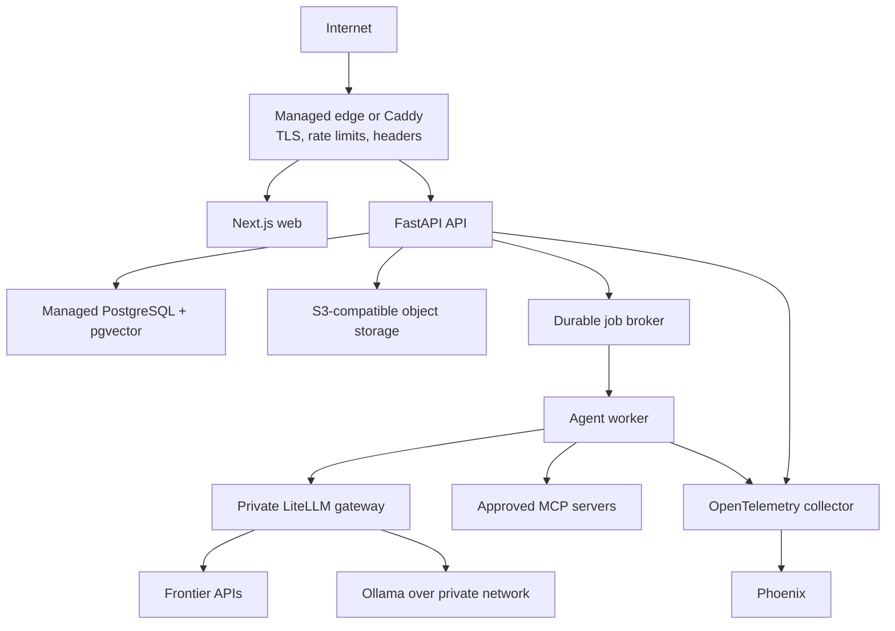

# Phase 5 — Production Readiness

## Outcome

The platform can be deployed for the owner as a secure, recoverable, observable production beta. Production readiness means more than “it runs in Docker”: identity, secrets, data isolation, backups, restore, cost control, incident response, security testing, and operating documentation all pass.

## Scope

### Included

- production threat model and security review;
- OIDC-based owner authentication;
- authorization and PostgreSQL row-level protections;
- secret manager integration and credential rotation;
- file, RAG, web, MCP, and skill-sandbox hardening;
- production containers, CI/CD, migrations, backups, and restore drills;
- object storage for source documents and exports;
- rate limits, quotas, cost budgets, alerts, and emergency stops;
- accessibility, responsive behavior, reliability, and performance work;
- privacy, retention, export, and deletion controls;
- monitoring, runbooks, and release checklist.

### Explicitly excluded from the initial production beta

- public self-service signup;
- subscription billing;
- multi-user teams and fine-grained collaboration;
- mobile applications;
- public skill or tool marketplace;
- Kubernetes and multi-region deployment;
- autonomous legal, financial, payment, publishing, or sales actions without human confirmation.

## Recommended first production topology

Use the smallest topology that meets the owner's reliability needs:

Prefer managed PostgreSQL and object storage unless self-hosting is a firm requirement. Keep Ollama and LiteLLM off the public internet. A local GPU host should connect through a private network or tunnel with explicit authentication and egress rules.

Do not introduce Kubernetes unless load tests show that a single deployment target and worker pool cannot meet the actual workload.

## Security requirements

### Identity and authorization

- delegate authentication to a maintained OIDC provider;
- use short-lived sessions and secure, HTTP-only cookies;
- validate issuer, audience, signature, expiry, and nonce;
- authorize company access on every request and background job;
- enable PostgreSQL RLS where practical;
- require recent authentication for credential, export, delete, and emergency-policy changes.

Do not build password storage or OAuth flows from scratch.

### Secrets

- keep provider, MCP, storage, and database credentials in a secret manager;
- store only secret references in the product database;
- redact secrets from errors, events, traces, prompts, and support bundles;
- rotate credentials and document revocation;
- use separate development, staging, and production credentials.

### Prompt injection and tool safety

- mark RAG, uploaded files, webpages, email, and tool results as untrusted content;
- keep permissions outside prompts;
- apply allow/confirm/block before every effect;
- restrict outbound hosts and protect private IP ranges to prevent SSRF;
- cap redirects, response size, duration, and content types;
- do not expose raw database, shell, or filesystem tools to general agents;
- show the owner the exact effect and destination before approval.

### Files and skills

- verify MIME type instead of trusting extension;
- set upload, page, archive, and extracted-text limits;
- reject archive path traversal and decompression bombs;
- scan uploaded files where the deployment threat model requires it;
- track provenance and license/ownership metadata;
- execute trusted skill scripts only in the constrained sandbox;
- pin exact skill and MCP versions and review updates.

### Privacy and model routing

- show when data will leave the local environment;
- enforce a local-only model policy when configured;
- define retention for prompts, outputs, documents, traces, and backups;
- do not store hidden chain-of-thought;
- let the owner export and delete company data;
- document third-party processors used by frontier models and search tools.

### Financial and legal agents

Outputs are drafts for owner review. The platform must not claim that an agent is a licensed professional or that generated advice is authoritative. Money movement, contract acceptance, tax filing, refunds, and legal publication remain confirmation-gated.

## Reliability requirements

- zero-downtime-compatible forward migrations where practical;
- job leases, retries, idempotency, and dead-letter handling;
- health, readiness, and dependency checks;
- bounded model and tool timeouts;
- graceful shutdown of workers;
- daily backups with encrypted retention;
- documented and tested point-in-time or snapshot restore;
- restore drill into an isolated environment;
- provider outage and local-model outage fallbacks;
- global emergency pause independent of the model runtime.

## Observability and alerts

Track:

- API and worker error rates;
- job queue depth and oldest-job age;
- run success, failure, cancellation, and approval wait time;
- provider latency and availability;
- tool errors and blocked actions;
- token use and estimated/actual cost by company;
- retrieval latency and evaluation drift;
- database connections, storage, backup age, and restore status;
- security events and repeated authorization failures.

Logs use correlation, company, run, work-item, and tool-invocation IDs. Logs never include full secrets, raw credentials, or private reasoning.

## Module order and coding-model ownership

All production security, deployment, and recovery work is grouped under GPT. Gemini owns the bounded product states, accessibility work, and operator-facing documentation after the production contracts are stable.

| Order | Module | Owner | Deliverable | Acceptance |
| --- | --- | --- | --- | --- |
| 1 | P5-M01 Threat model and production architecture | GPT | ADR-009, data flows, abuse cases, release risks | every trust boundary has controls and tests |
| 2 | P5-M02 Identity, authorization, RLS, and secrets | GPT | OIDC, policy enforcement, RLS, secret references/rotation | access-control and secret-leak tests pass |
| 3 | P5-M03 Deployment, CI/CD, migrations, and backups | GPT | production images, pipeline, staged migration, backup/restore automation | clean deploy and isolated restore drill pass |
| 4 | P5-M04 Agent-surface security hardening | GPT | injection, SSRF, egress, file, MCP, sandbox, budget controls | adversarial suite cannot cause unauthorized effects or data exfiltration |
| 5 | P5-M05 Load, failure, and recovery engineering | GPT | load tests, provider outage, queue backlog, chaos/recovery cases | service objectives and recovery targets pass |
| 6 | P5-M06 Final security and release audit | GPT | dependency review, threat retest, restore evidence, go/no-go report | no unresolved release-blocking finding |
| 7 | P5-M07 Production UX states | Gemini | session expiry, offline, degraded provider, maintenance, permission-denied states | failures are clear without leaking sensitive details |
| 8 | P5-M08 Security and privacy settings UI | Gemini | sessions, credential status, retention, export/delete, emergency controls | high-risk actions use clear confirmation and recent auth |
| 9 | P5-M09 Responsive and accessibility hardening | Gemini | keyboard, focus, contrast, mobile-width operations, error recovery | WCAG-oriented audit has no release-blocking issues |
| 10 | P5-M10 Performance and reliability UX | Gemini | large timelines, pagination, progress, retry/cancel clarity | target datasets remain usable and responsive |
| 11 | P5-M11 Operator docs and onboarding | Gemini | setup, model/privacy choices, runbooks, troubleshooting | a clean production setup follows documented steps |
| 12 | P5-M12 Release notes and owner walkthrough | Gemini | concise beta guide, known limitations, demo/checklist | owner can operate and stop the system safely |

## CI/CD gates

Every release requires:

- formatting, type checks, unit tests, integration tests, and end-to-end tests;
- migration compatibility check;
- isolation and authorization suites;
- prompt-injection and tool-policy regression suite;
- dependency, secret, container, and source scanning;
- software bill of materials;
- evaluation thresholds for changed prompts/models/retrieval;
- staging smoke test;
- backup freshness check;
- manual approval for production migration.

Do not let a model automatically approve its own production release.

## Performance targets to establish

Measure and set targets using real Phase 4 data rather than inventing large-scale requirements. At minimum define:

- dashboard and work-board response time at the expected company count;
- time to first run event;
- maximum reconnect time for SSE;
- maximum approval-to-resume time;
- queue recovery time after worker restart;
- maximum document-ingestion size and time;
- retrieval latency at the expected chunk count;
- recovery point and recovery time objectives.

## Required production drills

1. restore the database and object storage into isolation;
2. revoke a leaked model credential;
3. stop all write tools while read-only inspection remains available;
4. recover a worker that died around an approval boundary;
5. handle frontier provider outage with an approved fallback;
6. handle Ollama host outage without sending local-only data to cloud;
7. archive and restore one company;
8. export and permanently delete a test company;
9. investigate a suspicious MCP invocation from audit data;
10. roll back the application while keeping a compatible database.

## Release checklist

The production beta is ready only when:

- threat model and final security audit have no unresolved release blocker;
- authentication, authorization, RLS, and isolation tests pass;
- secrets are externalized and rotation is proven;
- backup and restore drills succeed;
- emergency pause and credential revocation are tested;
- costs and usage limits are visible and enforced;
- provider and worker failures degrade safely;
- all write/destructive operations remain approval-gated by default;
- accessibility and responsive checks pass for the owner journey;
- operator and incident runbooks are complete;
- known limitations are documented plainly.

Future work such as collaboration, billing, customer portals, and a marketplace begins only after the owner has used the production beta long enough to identify repeated, valuable workflows.
